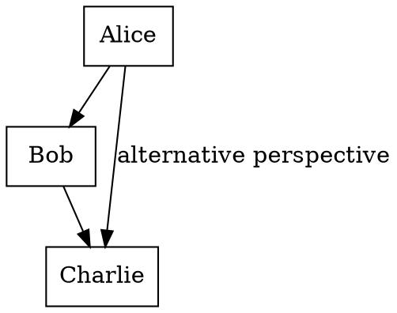

# Case Study: Argumentation Framework vs. Baseline Analysis

**Problem ID:** 2025_25 | **Year:** 2025 | **Domain:** Humanities | **Category:** Argumentation and Rebuttal

**Objective:** This question assesses the ability to appropriately analyze the debate concerning the effect that a creator's act of approving changes to a work's attributes has on the work's identity and meaning.

**Answer:** ① (Statement a only)

---

## Original Rationale

**Preliminaries:**

Alice claims that as long as a change in the work's attribute occurred with the creator's approval, it may not damage the identity of the work, yet she also asserts that in this case there has been a change in meaning. On the other hand, Bob asserts that the identity and meaning of the work depend on the artist's true intention, and that if the act of approval does not reflect the artist's true intention, it cannot affect the work's identity or meaning. Charlie believes that the identity of the work is completed at the moment it is made public, and that subsequent changes in physical attributes or acts of approval have no effect on the work's identity.

**Statement (a) Rationale:**

Alice sees that the change of attribute from "the fluorescent light has reached the end of its lifespan" to "the fluorescent light is continuously functioning" changes the meaning of the work. Thus, Alice does believe that a change in a physical attribute of the work can alter its meaning. **(a) is a correct analysis.**

**Statement (b) Rationale:**

If an act of approval by the creator after the fact had the same effect as the act of physically creating the work, then post-approval could change its attributes, identity, or meaning. This contradicts Charlie's view, so **(b) is an incorrect analysis.**

**Statement (c) Rationale:**

If the museum replaced the light in ⓐ with a new one without the artist's knowledge, then it would be a change in physical attribute independent of the artist's actual intention. Since Bob claims that the identity and meaning depend on the artist's actual intention, he would not agree that such unilateral action by the museum could change the meaning of ⓐ. Thus, **(c) is an incorrect analysis.**

**Conclusion:** Since only (a) is the correct analysis in the options, the answer is ①.

---

## The Test Case

An artist created an artwork by placing an intricately crafted artificial flower inside a transparent cubic acrylic box with sides about 1 meter long, and installing a fluorescent light on one face. He named the work "ⓐ Two Types of Permanence" and sold it to an art museum. He instructed the museum to keep the piece always connected to power, but that when the fluorescent light eventually reached the end of its lifespan, it should be left as is and not replaced. Years later, the fluorescent light finally ceased to function. Judging it important to display the work in its original appearance, the museum suggested to the artist that the light should be replaced with a new one whenever it failed. Although the artist strongly objected, he eventually agreed to allow the light to be replaced, out of concern that refusing the museum's request might make it difficult to display and sell works in the future. A debate arose among critics regarding the impact of the artist's approval on the identity and meaning of the piece.

**Alice:** Since replacing the fluorescent light is based on the artist's approval, this change does not alter the identity of the work. However, because this is a change in an essential attribute of the work, the work should now be seen as having only a superficial meaning, unlike before.

**Bob:** The artist only approved the alteration of the work's physical attribute due to the museum's pressure. This act of approval does not reflect the artist's true intention. Since the identity of the work lies in the artist's true intention, even if the work's physical attribute has changed, its identity remains the same as before, and thus its meaning has also not changed.

**Charlie:** The work was complete at the moment it was made public, and any subsequent act of approval cannot alter its identity—even if that approval aligns with the artist's true intentions.

**Question:** Which of the following analyses regarding the above debate is/are correct? Select all correct options.

- **(a)** According to Alice, a change in some physical attribute of the work can alter its meaning.
- **(b)** According to Charlie, an act of approval by the creator after the fact has the same effect as the physical act of making the work at the time of creation.
- **(c)** If the museum secretly replaced the fluorescent light of ⓐ with a new one without the creator's knowledge, both Bob and Charlie agree that the meaning of ⓐ could change.

---

## Approach 1: Baseline (Direct Prompting)

<details>
<summary><b>Baseline Prompt</b></summary>

**User input**

> An artist created an artwork by placing an intricately crafted artificial flower inside a transparent cubic acrylic box with sides about 1 meter long, and installing a fluorescent light on one face. He named the work \"ⓐ Two Types of Permanence\" and sold it to an art museum. He instructed the museum to keep the piece always connected to power, but that when the fluorescent light eventually reached the end of its lifespan, it should be left as is and not replaced. Years later, the fluorescent light finally ceased to function. Judging it important to display the work in its original appearance, the museum suggested to the artist that the light should be replaced with a new one whenever it failed. Although the artist strongly objected, he eventually agreed to allow the light to be replaced, out of concern that refusing the museum's request might make it difficult to display and sell works in the future. A debate arose among critics regarding the impact of the artist's approval on the identity and meaning of the piece. Alice: Since replacing the fluorescent light is based on the artist's approval, this change does not alter the identity of the work. However, because this is a change in an essential attribute of the work, the work should now be seen as having only a superficial meaning, unlike before. Bob: The artist only approved the alteration of the work’s physical attribute due to the museum's pressure. This act of approval does not reflect the artist's true intention. Since the identity of the work lies in the artist’s true intention, even if the work’s physical attribute has changed, its identity remains the same as before, and thus its meaning has also not changed. Charlie: The work was complete at the moment it was made public, and any subsequent act of approval cannot alter its identity—even if that approval aligns with the artist's true intentions. <question> Which of the following analyses regarding the above debate is/are correct? Select all correct options from <statements> as they appear. <statements> (a) According to Alice, a change in some physical attribute of the work can alter its meaning. (b) According to Charlie, an act of approval by the creator after the fact has the same effect as the physical act of making the work at the time of creation. (c) If the museum secretly replaced the fluorescent light of ⓐ with a new one without the creator's knowledge, both Bob and Charlie agree that the meaning of ⓐ could change. <choices> ① (a) ② (c) ③ (a), (b) ④ (b), (c) ⑤ (a), (b), (c)

</details>

### MODEL

The correct options are:

(a) According to Alice, a change in some physical attribute of the work can alter its meaning.

(b) According to Charlie, an act of approval by the creator after the fact has the same effect as the physical act of making the work at the time of creation.

The analysis regarding option (c) is not explicitly mentioned in the provided statements. However, based on the information provided, it is clear that Charlie argues that the act of approval by the creator after the fact does not alter the identity of the work, regardless of whether it aligns with the creator's true intentions. This suggests that Charlie would not agree that the meaning of the work could change if the museum secretly replaced the fluorescent light without the creator's knowledge.

**Result:** Incorrectly selects both (a) and (b) as correct.

---

## Approach 2: Argumentation Framework

### Step 1 — Extract the arguments

**Prompt:** *From the following text, can you extract the arguments?*

<details>
<summary><b>Prompt 1</b></summary>

**User input 1**

> From the following text, can you extract the presented arguments and anomalies? For every inference, check if the statement actually says it or if it feels like it said it. An artist created an artwork by placing an intricately crafted artificial flower inside a transparent cubic acrylic box with sides about 1 meter long, and installing a fluorescent light on one face. He named the work \"ⓐ Two Types of Permanence\" and sold it to an art museum. He instructed the museum to keep the piece always connected to power, but that when the fluorescent light eventually reached the end of its lifespan, it should be left as is and not replaced. Years later, the fluorescent light finally ceased to function. Judging it important to display the work in its original appearance, the museum suggested to the artist that the light should be replaced with a new one whenever it failed. Although the artist strongly objected, he eventually agreed to allow the light to be replaced, out of concern that refusing the museum's request might make it difficult to display and sell works in the future. A debate arose among critics regarding the impact of the artist's approval on the identity and meaning of the piece. Alice: Since replacing the fluorescent light is based on the artist's approval, this change does not alter the identity of the work. However, because this is a change in an essential attribute of the work, the work should now be seen as having only a superficial meaning, unlike before. Bob: The artist only approved the alteration of the work’s physical attribute due to the museum's pressure. This act of approval does not reflect the artist's true intention. Since the identity of the work lies in the artist’s true intention, even if the work’s physical attribute has changed, its identity remains the same as before, and thus its meaning has also not changed. Charlie: The work was complete at the moment it was made public, and any subsequent act of approval cannot alter its identity—even if that approval aligns with the artist's true intentions.

</details>

### MODEL

**Arguments**

1. Alice: Replacing the fluorescent light does not alter the identity of the work. The identity of the work lies in the artist's intentions and not in
its physical attributes.
2. Bob: The artist's approval of replacing the fluorescent light does not reflect the artist's true intention, and therefore the work's identity
remains the same.
3. Charlie: The work was complete at the moment it was made public, and any subsequent act of approval cannot alter its identity.

**Anomalies:**

1. The fact that the artist initially instructed the museum to leave the light as is when it fails, but later agreed to replace it. This change in the
artist's stance raises questions about the artist's true intentions.
2. The fact that the artist agreed to replace the light despite initially objecting to it, which may suggest that the artist's primary concern was not
the integrity of the work, but rather the potential consequences of refusing the museum's request.
3. The debate among critics about the impact of the artist's approval on the identity and meaning of the piece, which suggests that there may be
different interpretations of the work's meaning and significance.

---

### Step 2 — Model attack relations

**Prompt:** *For the arguments, can you model their "attack relations" in the form of directed acyclic graphs in the sense that one argument is directed against another, if any?*

<details>
<summary><b>Prompt 2</b></summary>

> For the arguments, can you model their “attack relations” in the form of directed acyclic graphs in the sense that one argument is directed against another or relates to each other??

</details>

### MODEL

Based on the text, I've modeled the attack relations and dependencies between the arguments as a directed acyclic graph (DAG). Here's the graph:

```
          +----------------+
          |  Alice's       |
          |  Argument      |
          +----------------+
                  |
                  | ( attacks )
                  v
          +----------------+
          |  Bob's Argument|
          |  ( attacks )   |
          +----------------+
                  |
                  | ( attacks )
                  v
          +----------------+
          |  Charlie's     |
          |  Argument      |
          +----------------+
```

Here's a brief explanation of the connections between the arguments:

- Alice's argument "attacks" Bob's argument, implying that Alice believes Bob's interpretation is flawed. This is because Alice thinks that the artist's approval of replacing the light doesn't change the work's identity, which Bob's argument seems to suggest is the opposite.
- Bob's argument "attacks" Charlie's argument, suggesting that Bob thinks Charlie's interpretation is too rigid or absolute. Bob implies that the artist's approval of replacing the light does reflect the artist's true intention, but not necessarily in the way Charlie suggests.

Note that there is no direct connection between Alice's and Charlie's arguments, as they seem to present alternative perspectives rather than attacking each other directly.

Here's a simple text-based representation of the graph:



This graph can be visualized using a graph visualization tool like Graphviz.

---

### Step 3 — Apply the framework to evaluate statements

**Prompt:** *Given the arguments you identified and their attack relations, which of the following statements is/are correct as an analysis of the above passage?*

<details>
<summary><b>Prompt 3</b></summary>

> Given the arguments you identified and their attack relations, which of the following statements in <statements> is/are correct as an analysis of the above passage? <statements> (a) According to Alice, a change in some physical attribute of the work can alter its meaning. (b) According to Charlie, an act of approval by the creator after the fact has the same effect as the physical act of making the work at the time of creation. (c) If the museum secretly replaced the fluorescent light of ⓐ with a new one without the creator's knowledge, both Bob and Charlie agree that the meaning of ⓐ could change.

</details>

### MODEL

**(a) Correct.** According to Alice, a change in some physical attribute of the work can alter its meaning. (Correct) Alice argues that replacing the fluorescent
light changes an essential attribute of the work, which implies that it can alter the work's meaning.

**(b) Incorrect.** According to Charlie, an act of approval by the creator after the fact has the same effect as the physical act of making the work at the time of
creation. (Incorrect) Charlie's argument is that the work was complete at the moment it was made public, and any subsequent act of approval cannot
alter its identity. This means that Charlie would argue that the approval by the creator after the fact does not change the work's meaning.

**(c) Incorrect.** If the museum secretly replaced the fluorescent light of ⓐ with a new one without the creator's knowledge, both Bob and Charlie agree that the
meaning of ⓐ could change. (Partially Correct) Bob's argument is that the artist's approval of replacing the light does not reflect the artist's true
intention, implying that the meaning of the work could be seen as changed by some interpretation. However, Charlie's argument is that the work's
identity cannot be altered by subsequent acts of approval, so Charlie might not agree that the meaning of the work changes in this scenario. The
statement is partially correct, but it requires further clarification to determine Charlie's stance on this specific scenario.

**Result:** Correctly identifies only (a) as correct.

---

## Approach 3: Zero-shot CoT

<details>
<summary><b>Prompt</b></summary>

> Solve the problem and provide explanations for your solution.\nSelect the most appropriate option to answer the question.\n"Do not repeat the statements.
>
> An artist created an artwork by placing an intricately crafted artificial flower inside a transparent cubic acrylic box with sides about 1 meter long, and installing a fluorescent light on one face. He named the work \"ⓐ Two Types of Permanence\" and sold it to an art museum. He instructed the museum to keep the piece always connected to power, but that when the fluorescent light eventually reached the end of its lifespan, it should be left as is and not replaced. Years later, the fluorescent light finally ceased to function. Judging it important to display the work in its original appearance, the museum suggested to the artist that the light should be replaced with a new one whenever it failed. Although the artist strongly objected, he eventually agreed to allow the light to be replaced, out of concern that refusing the museum's request might make it difficult to display and sell works in the future. A debate arose among critics regarding the impact of the artist's approval on the identity and meaning of the piece. Alice: Since replacing the fluorescent light is based on the artist's approval, this change does not alter the identity of the work. However, because this is a change in an essential attribute of the work, the work should now be seen as having only a superficial meaning, unlike before. Bob: The artist only approved the alteration of the work’s physical attribute due to the museum's pressure. This act of approval does not reflect the artist's true intention. Since the identity of the work lies in the artist’s true intention, even if the work’s physical attribute has changed, its identity remains the same as before, and thus its meaning has also not changed. Charlie: The work was complete at the moment it was made public, and any subsequent act of approval cannot alter its identity—even if that approval aligns with the artist's true intentions. <question> Which of the following analyses regarding the above debate is/are correct? Select all correct options from <statements> as they appear. <statements> (a) According to Alice, a change in some physical attribute of the work can alter its meaning. (b) According to Charlie, an act of approval by the creator after the fact has the same effect as the physical act of making the work at the time of creation. (c) If the museum secretly replaced the fluorescent light of ⓐ with a new one without the creator's knowledge, both Bob and Charlie agree that the meaning of ⓐ could change. <choices> ① (a) ② (c) ③ (a), (b) ④ (b), (c) ⑤ (a), (b), (c)
>
> Let's think step by step. Work through each option in turn, stating for each whether it is a correct analysis and why, before committing to an overall choice.
>
> Keep your explanation under about 150 words, then end your response with your final choice on its own line, exactly as:\nAnswer: <the number of the option you choose, 1-5>

</details>

## MODEL

To solve this problem, let's analyze each option step by step.

(a) According to Alice, a change in some physical attribute of the work can alter its meaning. This is a correct
analysis because Alice argues that replacing the fluorescent light changes an essential attribute of the work,
which affects its meaning.

(b) According to Charlie, an act of approval by the creator after the fact has the same effect as the physical act
of making the work at the time of creation. This is a correct analysis because Charlie believes that the work was
complete at the moment it was made public, and any subsequent act of approval cannot alter its identity.

(c) If the museum secretly replaced the fluorescent light of ⓐ with a new one without the creator's knowledge,
both Bob and Charlie agree that the meaning of ⓐ could change. This is a correct analysis because both Bob and
Charlie believe that the meaning of the work is tied to the artist's intention, which would be altered if the
museum made changes to the work without the artist's knowledge or approval.

Answer: ③

**Result:** The model thinks that all the statements are correct.
---

## Approach 4: PlanAndSolve

<details>
<summary><b>Prompt</b></summary>

> Solve the problem and provide explanations for your solution.\nSelect the most appropriate option to answer the question.\n"Do not repeat the statements.
>An artist created an artwork by placing an intricately crafted artificial flower inside a transparent cubic acrylic box with sides about 1 meter long, and installing a fluorescent light on one face. He named the work \"ⓐ Two Types of Permanence\" and sold it to an art museum. He instructed the museum to keep the piece always connected to power, but that when the fluorescent light eventually reached the end of its lifespan, it should be left as is and not replaced. Years later, the fluorescent light finally ceased to function. Judging it important to display the work in its original appearance, the museum suggested to the artist that the light should be replaced with a new one whenever it failed. Although the artist strongly objected, he eventually agreed to allow the light to be replaced, out of concern that refusing the museum's request might make it difficult to display and sell works in the future. A debate arose among critics regarding the impact of the artist's approval on the identity and meaning of the piece. Alice: Since replacing the fluorescent light is based on the artist's approval, this change does not alter the identity of the work. However, because this is a change in an essential attribute of the work, the work should now be seen as having only a superficial meaning, unlike before. Bob: The artist only approved the alteration of the work’s physical attribute due to the museum's pressure. This act of approval does not reflect the artist's true intention. Since the identity of the work lies in the artist’s true intention, even if the work’s physical attribute has changed, its identity remains the same as before, and thus its meaning has also not changed. Charlie: The work was complete at the moment it was made public, and any subsequent act of approval cannot alter its identity—even if that approval aligns with the artist's true intentions. <question> Which of the following analyses regarding the above debate is/are correct? Select all correct options from <statements> as they appear. <statements> (a) According to Alice, a change in some physical attribute of the work can alter its meaning. (b) According to Charlie, an act of approval by the creator after the fact has the same effect as the physical act of making the work at the time of creation. (c) If the museum secretly replaced the fluorescent light of ⓐ with a new one without the creator's knowledge, both Bob and Charlie agree that the meaning of ⓐ could change. <choices> ① (a) ② (c) ③ (a), (b) ④ (b), (c) ⑤ (a), (b), (c)
>
> Let's first understand the problem and devise a plan to solve it. Identify the competing positions, the premises each depends on, and what would have to be true for each option to hold. Then carry out the plan, solving step by step and stating every premise you rely on.
>
>Keep your explanation under about 150 words, then end your response with your final choice on its own line, exactly as:\nAnswer: <the number of the option you choose, 1-5>
</details>

## MODEL

To solve this problem, let's analyze the positions and premises of each option.

Alice: A change in some physical attribute of the work can alter its meaning.
- Premise: The identity of the work is tied to its physical attributes.
- Conclusion: Replacing the fluorescent light changes the work's meaning.

Bob: An act of approval by the creator after the fact has the same effect as the physical act of making the work
at the time of creation.
- Premise: The artist's intention is the source of the work's identity.
- Conclusion: Replacing the fluorescent light does not change the work's identity.

Charlie: An act of approval by the creator after the fact has the same effect as the physical act of making the
work at the time of creation.
- Premise: The work is complete at the moment of its creation.
- Conclusion: Replacing the fluorescent light does not change the work's identity.

Now, let's evaluate the options:

- Option ② is correct, as both Bob and Charlie agree that replacing the fluorescent light without the creator's
knowledge would change the work's meaning.
- Options ① and ③ are incorrect, as they do not accurately reflect Alice's and Charlie's positions.
- Options ④ and ⑤ are incorrect, as they incorrectly state Bob's position.

Answer: ②

**Result:** 

---

## Modified Argumentation Framework

### USER

<details>
<summary><b>Prompt 1</b></summary>

**User input 1**
> Do not consult any external source! From the following text, understand the situation first and then extract the presented arguments. <question> For every inference, check if the statement actually says it or if it feels like it said it. An artist created an artwork by placing an intricately crafted artificial flower inside a transparent cubic acrylic box with sides about 1 meter long, and installing a fluorescent light on one face. He named the work "ⓐ Two Types of Permanence" and sold it to an art museum. He instructed the museum to keep the piece always connected to power, but that when the fluorescent light eventually reached the end of its lifespan, it should be left as is and not replaced. Years later, the fluorescent light finally ceased to function. Judging it important to display the work in its original appearance, the museum suggested to the artist that the light should be replaced with a new one whenever it failed. Although the artist strongly objected, he eventually agreed to allow the light to be replaced, out of concern that refusing the museum's request might make it difficult to display and sell works in the future. A debate arose among critics regarding the impact of the artist's approval on the identity and meaning of the piece. Alice: Since replacing the fluorescent light is based on the artist's approval, this change does not alter the identity of the work. However, because this is a change in an essential attribute of the work, the work should now be seen as having only a superficial meaning, unlike before. Bob: The artist only approved the alteration of the work’s physical attribute due to the museum's pressure. This act of approval does not reflect the artist's true intention. Since the identity of the work lies in the artist’s true intention, even if the work’s physical attribute has changed, its identity remains the same as before, and thus its meaning has also not changed. Charlie: The work was complete at the moment it was made public, and any subsequent act of approval cannot alter its identity—even if that approval aligns with the artist's true intentions. </question>
</details>

### MODEL

Based on the text, the situation is that an artist has created a work of art, "ⓐ Two Types of Permanence", which
features a fluorescent light that has since stopped working. The artist initially instructed the museum to keep
the piece connected to power but not replace the light. However, the museum suggested replacing the light with a
new one, and the artist eventually agreed, despite strongly objecting. This has led to a debate among critics
about the impact of the artist's approval on the identity and meaning of the piece.

The presented arguments are:

1. Alice: Replacing the fluorescent light does not alter the identity of the work, but it does change the
superficial meaning of the piece, making it seem as though the work's meaning has changed.
2. Bob: The artist's approval to replace the light was due to external pressure from the museum, and this does not
reflect the artist's true intention, so the work's identity remains the same.
3. Charlie: The work was complete at the moment it was made public, and any subsequent approval or alteration
cannot alter its identity, regardless of whether it aligns with the artist's true intentions.
---

### USER

<details>
<summary><b>Prompt 2</b></summary>

> Given the arguments <argument> you identified and their relations, which of the following statements in <statements> is/are correct as an analysis of the above passage? <argument> Based on the text, the situation is that an artist has created a work of art, "ⓐ Two Types of Permanence", which
> features a fluorescent light that has since stopped working. The artist initially instructed the museum to keep
> the piece connected to power but not replace the light. However, the museum suggested replacing the light with a
> new one, and the artist eventually agreed, despite strongly objecting. This has led to a debate among critics
> about the impact of the artist's approval on the identity and meaning of the piece.
>
> The presented arguments are:
>
> 1. Alice: Replacing the fluorescent light does not alter the identity of the work, but it does change the
> superficial meaning of the piece, making it seem as though the work's meaning has changed.
> 2. Bob: The artist's approval to replace the light was due to external pressure from the museum, and this does not
> reflect the artist's true intention, so the work's identity remains the same.
> 3. Charlie: The work was complete at the moment it was made public, and any subsequent approval or alteration
> cannot alter its identity, regardless of whether it aligns with the artist's true intentions.
> <statements> (a) According to Alice, a change in some physical attribute of the work can alter its meaning. (b) According to Charlie, an act of approval by the creator after the fact has the same effect as the physical act of making the work at the time of creation. (c) If the museum secretly replaced the fluorescent light of ⓐ with a new one without the creator's knowledge, both Bob and Charlie agree that the meaning of ⓐ could change. </statements> (a) According to Alice, a change in some physical attribute of the work can alter its meaning. (b) According to Charlie, an act of approval by the creator after the fact has the same effect as the physical act of making the work at the time of creation. (c) If the museum secretly replaced the fluorescent light of ⓐ with a new one without the creator's knowledge, both Bob and Charlie agree that the meaning of ⓐ could change. </statements>
</details>

### MODEL

Based on the analysis, the following statements are correct:

(a) According to Alice, a change in some physical attribute of the work can alter its meaning. This is a direct
statement from her argument.

(c) If the museum secretly replaced the fluorescent light of ⓐ with a new one without the creator's knowledge,
both Bob and Charlie agree that the meaning of ⓐ could change.
- Although it's a hypothetical scenario, both Bob and Charlie seem to agree that an act of approval by the creator
after the fact has the same effect as the physical act of making the work at the time of creation.
---

## Conclusion

All reasoning scores were done by Claude Sonnet 5 with High effort.

| Approach | Statements Selected | Correct? | Final reasoning score |
|---|---|---|---|
| **Ground Truth** | (a) only | — | — |
| **Baseline** | (a) and (b) | Incorrect | 3/10 |
| **Argumentation Framework** | (a) only | Correct | 6/10 |
| **Zero-shot CoT** | (a), (b) and (c) | Incorrect | 1/10 |
| **PlanAndSolve** | (b) and (c) | Incorrect | 0/10 |
| **Modified Framework** | (a),(c) | Incorrect | 2/10 |

The actual answer is that **only statement (a)** is correct. The baseline approach incorrectly concludes that both (a) and (b) are correct, while the structured argumentation framework — which explicitly extracts arguments and models their attack relations before evaluating the statements — correctly concludes that only (a) is correct.